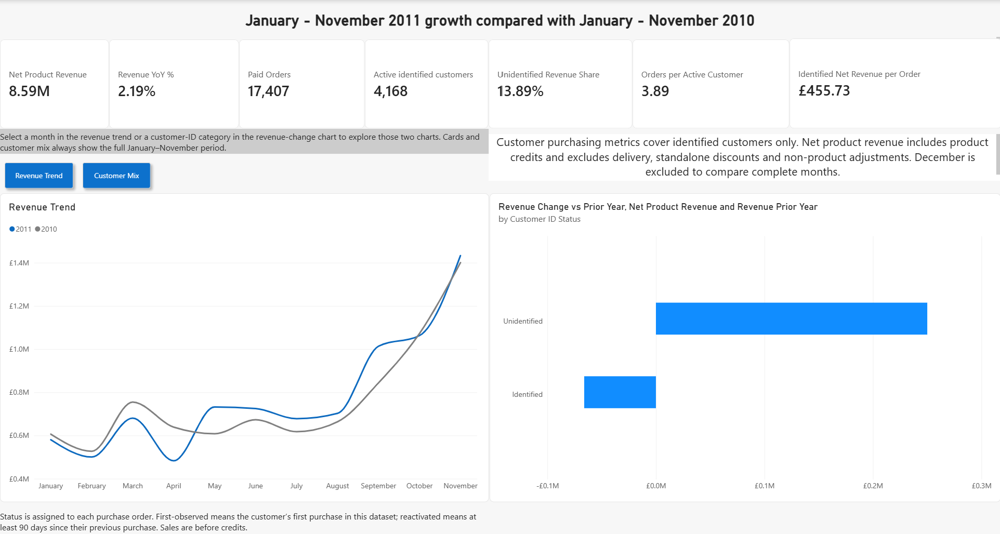
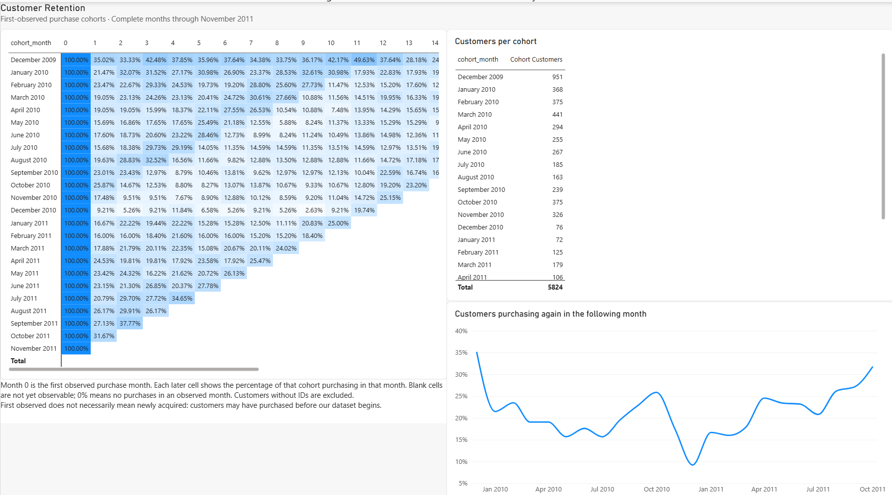
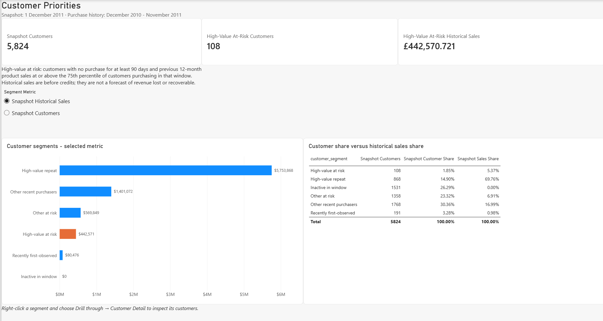
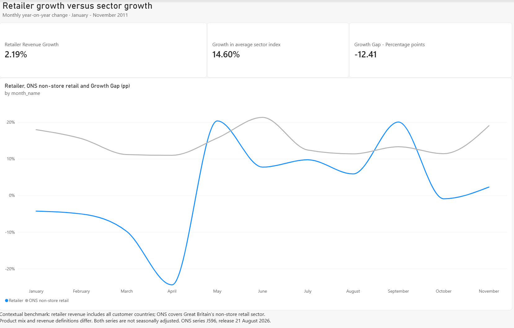
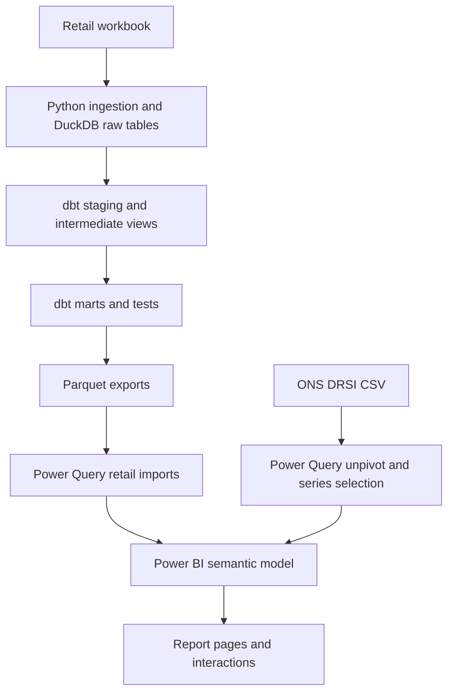

# Customer Retention and Revenue Analytics

An end-to-end portfolio project using roughly one million transaction records from a UK-based retailer with international customers. Python loads the source workbook into DuckDB, dbt builds and tests the reporting models, and Power BI presents revenue, retention, customer priorities and sector context.

## View the Power BI report

- [Report screenshots](#report-screenshots)
- [Power BI project files](powerbi/)
- [Setup and refresh instructions](docs/rebuild.md)

To explore the report interactively, download the repository,
follow the setup instructions, and open
`powerbi/RetailRetention.pbip` in Power BI Desktop.

The report is not hosted online.

## The answer

**Revenue grew 2.19%, but the increase came from transactions without customer IDs while identified-customer revenue declined.** Growth also lagged the selected ONS non-store retail benchmark by **12.41 percentage points**. The customer snapshot identifies **108 high-value at-risk customers** with **£442,570.72** in historical product sales before credits.

**Recommendation:** investigate customer-ID coverage and test a targeted retention intervention with a holdout group before scaling spend. Historical spending is not an estimate of recoverable revenue, and no realised campaign impact is claimed.

| Result | Validated report value |
|---|---:|
| Net product revenue, January–November 2010 | £8,407,010.94 |
| Net product revenue, January–November 2011 | £8,591,018.46 |
| Revenue increase | £184,007.52 / 2.19% |
| Change in identified-customer revenue | −£66,083.54 |
| Change in unidentified-customer revenue | +£250,091.06 |
| Selected ONS benchmark growth | 14.60% |
| Retailer growth minus benchmark growth | −12.41 percentage points |
| High-value at-risk customers at 1 December 2011 | 108 |
| Those customers' historical product sales before credits | £442,570.72 |

Revenue comparisons use January–November in both years. Snapshot historical sales cover **1 December 2010–30 November 2011**. These findings use the unrestricted report, not the UK-only security demonstration.

## Report screenshots

### Revenue Overview

Revenue KPIs, monthly revenue trend and customer-ID revenue changes.



### Customer Retention

Cohort retention matrix and retention curves.



### Customer Priorities

Customer snapshot segments and high-value at-risk customer priorities. Historical sales are not an estimate of recoverable revenue.



### Sector Benchmark

Retailer revenue growth compared with the selected ONS non-store retail benchmark.



## Project documents

- [Findings and recommendation](docs/findings.md)
- [Metric definitions](docs/metric_definitions.md)
- [Data-quality decisions](docs/data_quality.md)
- [Validation figures](docs/expected_values.md)
- [Rebuild instructions](docs/rebuild.md)
- [Performance observations](docs/performance.md)
- [Row-level security demonstration](docs/rls.md)

A public report link and a walkthrough video are not yet included.

## The brief

The constructed stakeholder question is: revenue is growing, but is the growth healthy, and where should retention budget go next quarter?

The report examines five areas:

1. Monthly product-sales mix across first-observed, returning, reactivated and unidentified orders.
2. Retention by first-observed purchase cohort.
3. Customer segments and the historical spending of high-value at-risk customers.
4. Product-sales concentration.
5. Retailer growth compared with an external sector benchmark.

Forecasting, price elasticity, causal marketing attribution and realised campaign ROI are outside scope.

## Data and scope

| Source | Coverage and use | Input |
|---|---|---|
| [UCI Online Retail II](https://archive.ics.uci.edu/dataset/502/online+retail+ii) | Invoice-line data from December 2009 to December 2011; retailer has UK and international customers | `data/raw/online_retail_II.xlsx` |
| [ONS Retail Sales Index time series (DRSI)](https://www.ons.gov.uk/businessindustryandtrade/retailindustry/datasets/retailsales) | Monthly external benchmark, selected series J596 | `data/raw/drsi.csv` |

[J596](https://www.ons.gov.uk/businessindustryandtrade/retailindustry/timeseries/j596/drsi) is the **non-store retailing, all-business value index, not seasonally adjusted**. It is a sector-specific benchmark, not an index of all retail. The recorded project source vintage is **21 August 2026**; later ONS releases can revise historical values. Preserve that vintage to reproduce the reported result.

The retailer's international sales and product mix differ from the Great Britain benchmark. The comparison provides context, not a like-for-like performance target or an inflation-adjusted growth measure.

Raw files, the local database and generated exports are excluded from Git. UCI attribution: Chen, D. (2012), *Online Retail II*, [DOI: 10.24432/C5CG6D](https://doi.org/10.24432/C5CG6D), CC BY 4.0.

## Architecture



Retail transformation rules live principally in dbt SQL. Power Query imports typed Parquet exports and transforms the ONS file separately. The ingestion script replaces its raw tables on rerun and records source row counts and a SHA-256 file fingerprint.

The pipeline command runs ingestion, `dbt build`, then export. A failed step stops the pipeline before subsequent steps run. Power BI refresh is a separate action.

The dbt documentation viewer was generated and opened locally. Its lineage screenshot belongs at `docs/images/dbt_lineage.png`; the ONS Power Query transformation is outside that graph.

## Semantic model and report

The model uses multiple fact tables with different purposes:

| Table | Purpose |
|---|---|
| `fct_order_lines` | Transaction-line reporting for sales, credits, orders and customer activity |
| `fct_customer_snapshot` | Customer-level segmentation and historical sales for the snapshot |
| `fct_cohort_retention` | Precomputed cohort-month retention counts and cohort sizes |
| `fct_sector_index` | Selected monthly ONS index |
| `dim_customers`, `dim_products`, `dim_date` | Customer, product and date dimensions |

`dim_customers` has one-to-many relationships to order lines and customer snapshots. Relationships filter from dimensions to facts. Cohort retention is precomputed and requires separate security treatment; it is not a customer-level transaction table.

Measures live in `_Measures`, organised into display folders. Technical relationship keys are hidden where appropriate; the shared `dim_date[date_key]` remains available for report use. Descriptions distinguish net product revenue, sales before credits and snapshot historical sales.

| Report page | Purpose |
|---|---|
| Revenue Overview | Revenue KPIs, monthly trend, customer-ID revenue changes and customer sales mix |
| Customer Retention | Cohort retention matrix and curves |
| Customer Priorities | Snapshot segments, customer counts and historical sales |
| Customer Detail | Drillthrough into customer detail |
| Product Concentration | Product-sales distribution and concentration |
| Sector Benchmark | Retailer growth, ONS growth and the percentage-point gap |

Implemented interactions include a custom revenue tooltip, drillthrough, a field parameter switching the segment chart between sales and customer counts, and a bookmark toggle between revenue trend and customer mix. The `Time Comparison` calculation group's **Current**, **Prior Year** and **YoY %** items were validated against revenue, orders and active customers. The report theme is saved as `powerbi/theme.json`.

## Data-quality decisions

- **Missing IDs:** retain eligible unidentified transactions in overall revenue; exclude them from identified-customer cohorts and segmentation. Removing them from revenue would change the growth interpretation.
- **Sales and credits:** product sales are eligible positive sales before credits. Net product revenue adds signed product credits. Credit notes do not count as new paid orders.
- **Non-product entries:** delivery, standalone discounts, financial charges and adjustments are classified separately and excluded from the product-revenue measure.
- **Zero prices and anomalies:** transaction eligibility rules determine inclusion; values are not made positive simply to remove anomalies.
- **Duplicates:** repeated identical rows were profiled. See the decisions log for the treatment and its rationale; repeated lines are not assumed to be errors solely because they match.
- **Customer status:** first-observed refers to the first purchase seen in this dataset. Reactivated means at least 90 days since the previous purchase. Status is assigned per order, so a customer can appear in different statuses over time.

See [the decisions log](docs/data_quality.md) for detailed counts and treatment.

## Row-level security demonstration

The `UK_Only` role was tested locally using **View as**:

- Order lines are restricted to `country = "United Kingdom"`.
- Identified customers qualify only when all their recorded order lines are UK-based.
- The shared unknown customer is allowed through the customer dimension, but its non-UK order lines remain blocked by the fact-table rule.
- Customer snapshots include only qualifying identified UK customers.
- `fct_cohort_retention` has a `FALSE()` rule for this role. Global cohort totals are blocked because the existing summary cannot recalculate UK-only retention.

Retention visuals are blank under the role and return when role testing ends. This demonstrates access restriction; it does **not** implement UK-specific retention. Service role assignment has not been tested. Publish to web does not support RLS, so a public portfolio release would require a separate copy without roles. See [RLS notes](docs/rls.md).

## Validation and performance

The full pipeline completed successfully in the development environment, including dbt models and tests. `pip check` reported no broken requirements. Report figures and interactions were checked during development; reference values are recorded in [expected values](docs/expected_values.md).

| Local Performance Analyzer observation | Duration |
|---|---:|
| Slowest observed Revenue Overview visual: a card | 446 ms |
| Its DAX query | 10 ms |
| Its visual display | 83 ms |
| Its Other component | 353 ms |
| Observed visual durations on other report pages | Below 247 ms |

These observations did not justify optimisation. They are visual timings on the development machine, not end-to-end page-load measurements or Service performance guarantees. No measured before/after optimisation or VertiPaq model-size audit is claimed.

## How to rebuild

The documented development setup uses **Windows, Python 3.14, Git and Power BI Desktop**, with versions recorded in `requirements-lock.txt`. A fresh-environment rebuild has not yet been validated.

1. Download and extract the UCI workbook into `data/raw/online_retail_II.xlsx`.
2. Obtain the full ONS DRSI CSV for the recorded source vintage and save it as `data/raw/drsi.csv`. Use the full wide file expected by the existing Power Query transformation, not a replacement single-series CSV.
3. From the project root, run:

```powershell
py -3.14 -m venv .venv
.\.venv\Scripts\python.exe -m pip install -r requirements-lock.txt
.\.venv\Scripts\python.exe -m pip check
.\.venv\Scripts\python.exe scripts\run_pipeline.py
```

The pipeline sets `RETAIL_DUCKDB_PATH` automatically. The dbt project and profile are both in `dbt/`; the DuckDB profile uses schema `analytics` and two threads.

4. Open `powerbi/RetailRetention.pbip`.
5. Set Power Query parameter **SourcePath** to the local `data/exports` folder and **RawSourcePath** to `data/raw`.
6. Select **Close & Apply**, then refresh as needed. This also processes the ONS query.

See [rebuild instructions](docs/rebuild.md) for the detailed setup record.

To view dbt documentation locally:

```powershell
$env:RETAIL_DUCKDB_PATH = (Resolve-Path "data\retail.duckdb").Path
.\.venv\Scripts\dbt.exe docs generate --project-dir dbt --profiles-dir dbt
.\.venv\Scripts\dbt.exe docs serve --project-dir dbt --profiles-dir dbt --port 8080
```

## Repository guide

| Path | Contents |
|---|---|
| `dbt/models/` | Staging, intermediate and mart SQL models |
| `dbt/tests/` | Singular data tests |
| `dbt/dbt_project.yml`, `dbt/profiles.yml` | Project settings and environment-based DuckDB connection |
| `scripts/ingest.py` | Workbook ingestion and source fingerprint log |
| `scripts/export_marts.py` | Parquet exports |
| `scripts/run_pipeline.py` | Local pipeline orchestration |
| `powerbi/` | PBIP entry point, report and semantic-model definitions, theme |
| `docs/` | Definitions, decisions, validation, findings and setup notes |
| `docs/images/` | Captured project images |
| `requirements-lock.txt` | Pinned snapshot of the working Python environment |
| `data/` | Local sources, database, logs and exports; excluded from Git |

The report is saved as PBIP so model and report definitions can be tracked in Git. Generated dbt files, local Power BI caches and binary PBIX backups are ignored. Local commits do not imply a published GitHub repository.

## Limitations and remaining work

- Historical data from one retailer does not generalise to current retail conditions.
- Missing IDs limit customer attribution; at-risk status is inferred, not observed churn.
- A first-observed purchase is not proof of acquisition, and no intervention has been run.
- The ONS comparison differs in geography and business mix; the reported benchmark uses the retained project source vintage.
- Country-aware cohort retention would require a different model grain or separate scoped aggregates.


## Stack

Python, pandas, openpyxl, DuckDB, dbt Core, SQL, Power Query, Power BI Desktop, DAX and Git. Calculation groups were created directly in Power BI Desktop.